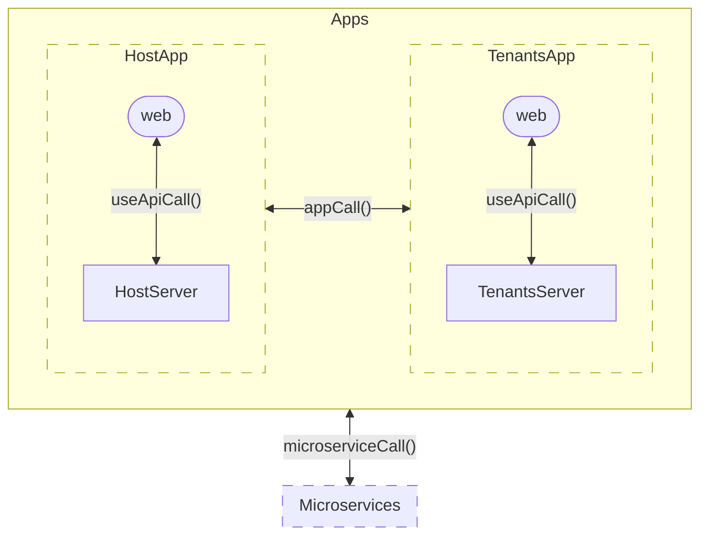

# Digitalni web - SaaS

## Download

Download with submodules (digitalniweb-custom, digitalniweb-types):

git clone --recurse-submodules https://github.com/digitalniweb/saas.git .

Now change all submodules git branches to MASTER

## Installation

```bash
npm run i
```

## Migrations

Use following code to compile .ts to .js files for migrations for Sequelize

```bash
npm run migrations
```

## Development Server

Start the development server on http://localhost:3000

```bash
npm run dev
```

## Production

Build the application for production:

```bash
npm run build
```

Locally preview production build:

```bash
npm run preview
```

Check out the [deployment documentation](https://nuxt.com/docs/getting-started/deployment) for more information.

## Update Nuxt

```
npx nuxi upgrade
```

## Icons

List of [mdi icons](https://pictogrammers.com/library/mdi/) to use

## Communication between Apps and Services


